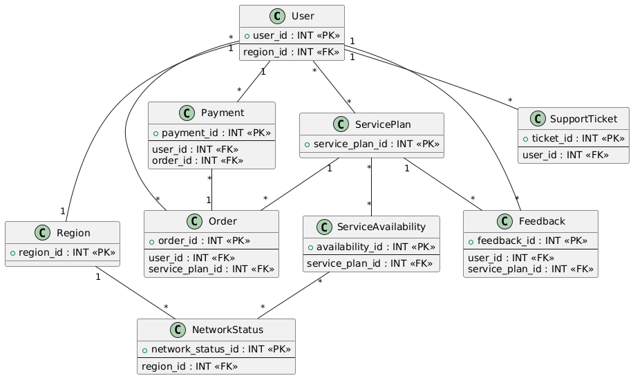

#  Network provider backend system

## Overview

This Spring Boot project is a simple backend MVP solution for a network provider platform, designed to manage customer accounts, service plans, orders, payments, and support tickets. It enables handling of customer interactions, service availability, and network status, offering a seamless experience for users.

## This is a class diagram without full attributes and methods

